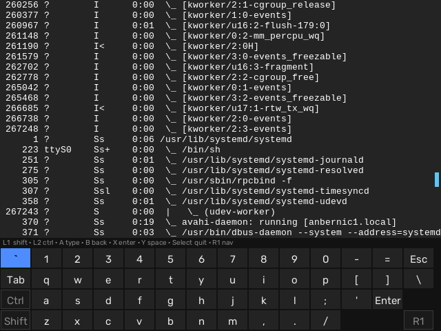
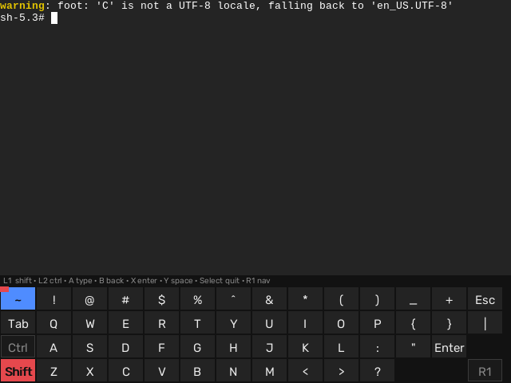
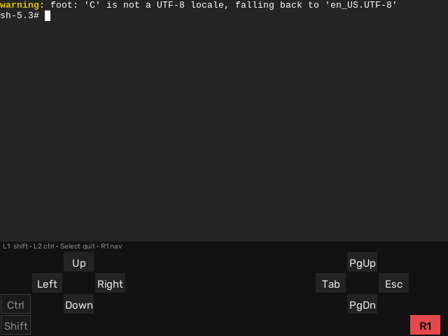

# lowkey

An on-screen keyboard for typing with a gamepad.

Built for ROCKNIX handhelds running sway, where a controller is the only
input device. It draws a grid of keys on a layer-shell surface that never
takes keyboard focus, reads the pad straight from evdev, and types through a
uinput device. Keystrokes land in whatever the compositor has focused, so no
pointer, no compositor-specific IPC, and no input-method support is needed.



## Controls

| Button          | Action                                    |
| --------------- | ------------------------------------------ |
| D-pad / hat      | Move selection (wraps, auto-repeats)      |
| A (`BTN_EAST`)   | Type the selected key                     |
| B (`BTN_SOUTH`)  | Backspace                                 |
| Y (`BTN_NORTH`)  | Space                                     |
| X (`BTN_WEST`)   | Enter                                     |
| L1               | Hold for Shift                            |
| L2               | Hold for Ctrl                             |
| R1 (hold)        | Nav chord — see below                     |
| Select           | Quit                                      |

The X/Y codes are swapped from the standard Nintendo-layout convention on
this device's driver (confirmed with an evdev capture) — see the doc comment
on `pad::decode`. A and B match the B-is-back convention on this device's
Nintendo-style layout.

Shift and Ctrl are held modifiers, like a real keyboard: for as long as L1
or L2 is physically down, shifted symbol keys show their shifted glyph live,
and the grid's Ctrl/Shift indicator cells light up.



Holding R1 replaces the grid with a D-pad/face-button overlay for moving a
real text cursor or paging a surface, instead of moving the grid selection:
the D-pad sends arrow keys, and X/Y/A/B send PageUp/Tab/Esc/PageDown.



A legend line above the grid always spells out what every button currently
does, swapping to R1's own hints while its nav chord is held.

## Build

```
make                                    # cross-builds target/aarch64-unknown-linux-gnu/release/lowkey
make install        HOST=root@192.0.2.1   # scp to the device, killing any running instance first
make install-config HOST=root@192.0.2.1   # scp rocknix/foot.ini and rocknix/Terminal.sh into place
```

`install` and `install-config` require `HOST` on the command line. The
target needs `rustup target add aarch64-unknown-linux-gnu` and an
`aarch64-linux-gnu-gcc` on `PATH` for linking (configured in
`.cargo/config.toml`).

## Usage

```
lowkey [-h height] [-p pad-name] [-f font-path] [--print-height]
```

- `-h` sets the surface height in pixels (default 126); `--print-height`
  prints the effective height and exits, so a launcher script can reserve
  that much screen space without hardcoding it.
- `-p` picks the gamepad by a substring of its evdev name; without it,
  lowkey auto-detects the first device with a `BTN_SOUTH`.
- `-f` (or `$LOWKEY_FONT`) points at a TTF/OTF font, rendered with
  `fontdue`. The default, `/usr/share/fonts/truetype/dejavu/DejaVuSansMono.ttf`,
  doesn't exist on ROCKNIX — see `rocknix/Terminal.sh`.

## Grid layout

14x4 QWERTY. Each row holds a physical QWERTY row's keys at their real
position, trailing punctuation included (`-`/`=`/Esc end the digit row,
`[`/`]`/`\` end the letter row, Ent ends the home row, matching an ANSI
keyboard). The home and bottom rows lead with a Ctrl/Shift indicator cell
instead of a real key, which — like every other row's leading key — keeps
1/Q/A/Z aligned in the same column. The bottom row's last cell holds the R1
indicator. Rows shorter than the 14-key letter row run out of real keys
before the last column; those cells stay empty rather than fake a key that
isn't there.

## rocknix/

`foot.ini` and `Terminal.sh` (the EmulationStation Ports launcher that opens
a shell with lowkey's overlay) live here because lowkey's own behavior drives
their content directly: `foot.ini`'s `scrollback-up-page`/`down-page` bind to
bare `Page_Up`/`Page_Down` because that's what lowkey's R1 chord sends, and
`Terminal.sh` hardcodes lowkey's font path and reserves screen space with
`--print-height`. `make install-config` deploys both.

lowkey also cross-builds with no runtime dependency on the device's
libwayland: `wayland-client`'s pure-Rust backend speaks the wire protocol
directly, so there's nothing to pull off the device before linking.
